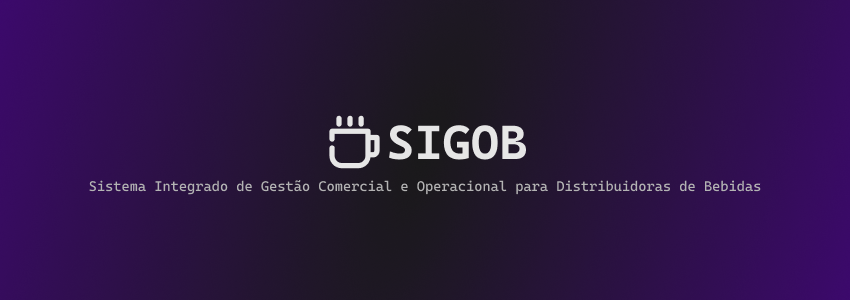

# 
> **Projeto acadêmico, desenvolvido utilizando Java 17, Maven, Hibernate, JPA & Flyway, executado no Terminal, com a finalidade de resolver um problema generalizado de demandas para Empresas do ramo de Bebidas e Distribuição.**

# Fluxo
1. O sistema permite o login ao entrar nele, exibindo um menu de opções (módulos) dependendo do nível de acesso do Usuário. (Admin, Estoque, Caixa, ...);
2. O usuário pode registrar diversas entidades que fazem o sistema, como por exemplo: Produtos (nome, descrição, valor de compra & venda), Cliente (nome, documento [CPF, CNPJ, SKU], data de nascimento), Usuário (login, código [para identificar vendas]), e dentre vários outros;
3. O módulo de vendas permite que o Usuário (desde que tenha nível de acesso adequado) inicie, continue ou finalize vendas. Cada venda consiste de um funcionario (quem vende) e um cliente (quem compra);
4. Para fins de controle, há o módulo de Estoques, aonde é possivel organizar produtos por setores. (ex: há 10 latas de coca cola no Estoque A e 5 no Estoque B), o mesmo permite que também possa haver transfêrencia de produtos entre estoques;
5. Por fim, o módulo de relatórios permite a observação de ocorrências (produtos vendidos, pagamentos) perante certos fatores (data, funcionario, cliente, ...)

# Estrutura
```
├── cli/                    # Interfaces do Terminal
│   ├── Menu.java
│   ├── MenuAcesso.java
│   ├── MenuCadastros.java
│   ├── MenuCategoria.java
│   ├── MenuCliente.java
│   ├── MenuEstoque.java
│   ├── MenuEstoques.java
│   ├── MenuFuncionario.java
│   ├── MenuMain.java
│   ├── MenuMoeda.java
│   ├── MenuProduto.java
│   └── MenuVendas.java
├── config/                 # Configurações de Projeto
│   ├── FlywayConfig.java
│   └── JPAConfig.java
├── entity/                 # Entidades da Aplicação
│   ├── Acesso.java
│   ├── Categoria.java
│   ├── Cliente.java
│   ├── Estoque.java
│   ├── Funcionario.java
│   ├── Moeda.java
│   ├── Produto.java
│   ├── ProdutosEstoques.java
│   ├── ProdutosVendas.java
│   └── Venda.java
├── exception/              # Exceções por entidade
│   ├── AcessoException.java
│   ├── CategoriaException.java
│   ├── ClienteException.java
│   ├── EstoqueException.java
│   ├── FuncionarioException.java
│   ├── MoedaException.java
│   ├── ProdutoException.java
│   ├── ProdutosEstoquesException.java
│   ├── ProdutosVendasException.java
│   └── VendaException.java
├── repository/             # Repositórios
│   ├── AcessoRepository.java
│   ├── CategoriaRepository.java
│   ├── ClienteRepository.java
│   ├── EstoqueRepository.java
│   ├── FuncionarioRepository.java
│   ├── MoedaRepository.java
│   ├── ProdutoRepository.java
│   ├── ProdutosEstoquesRepository.java
│   ├── ProdutosVendasRepository.java
│   └── VendaRepository.java
├── service/                # Serviços
│   ├── AcessoService.java
│   ├── CategoriaService.java
│   ├── ClienteService.java
│   ├── EstoqueService.java
│   ├── FuncionarioService.java
│   ├── MoedaService.java
│   ├── ProdutoService.java
│   ├── ProdutosEstoquesService.java
│   ├── ProdutosVendasService.java
│   └── VendaService.java
├── util/                   # Módulos utilitários
│   └── Inputter.java
└── Main.java               # Arquivo principal
```
